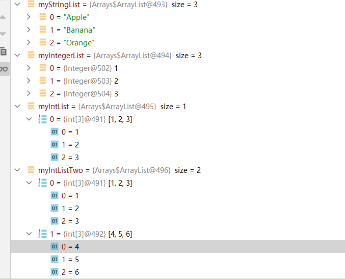
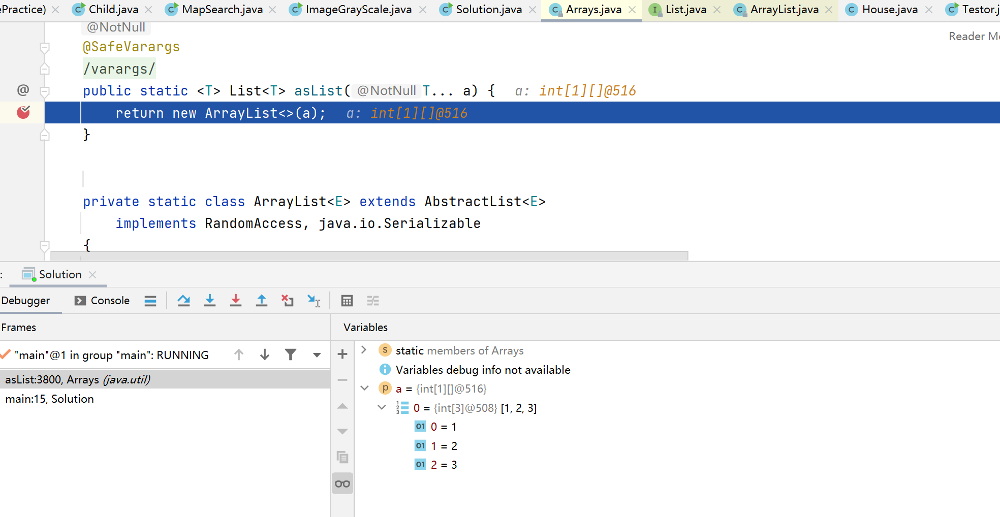
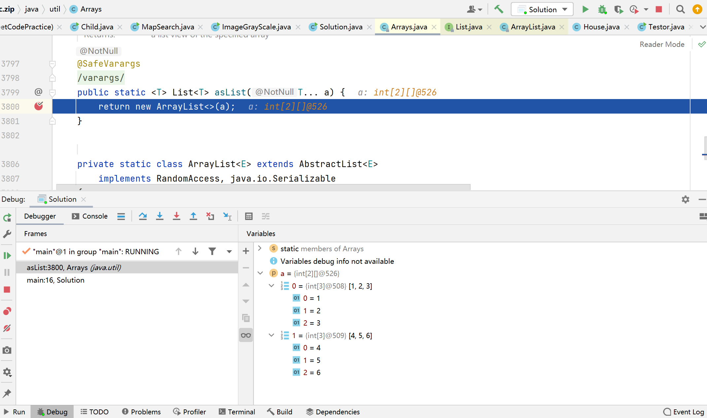
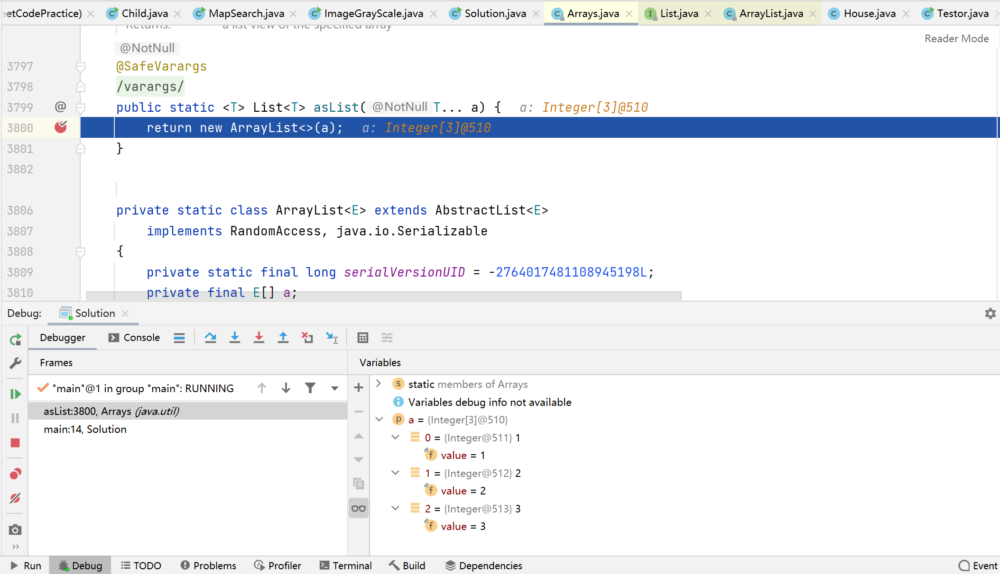
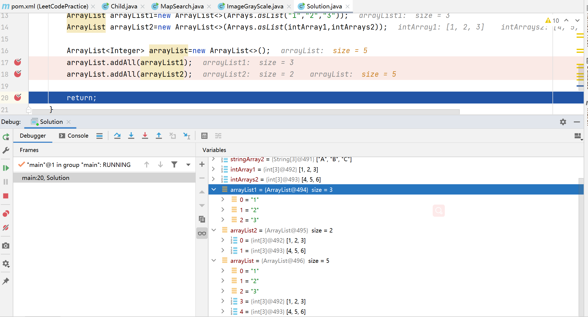

参考链接：

· [Arrays.asList使用指南](https://www.jianshu.com/p/2b113f487e5e)

· [Collections addAll() method in Java with Examples](https://www.geeksforgeeks.org/collections-addall-method-in-java-with-examples/)

# Arrays.asList
```java
    String[] myArray={"Apple","Banana","Orange"};
    int[] intArrays={1,2,3};
    int[] intArraysTwo={4,5,6};
    List<String> myStringList=Arrays.asList(myArray);
    List<Integer> myIntegerList=Arrays.asList(1,2,3);
    List myIntList=Arrays.asList(intArrays);
    List myIntListTwo=Arrays.asList(intArrays,intArraysTwo);
```
运行结果：


## 注意点

### 当原生数据类型数据的数组作为参数时

```java
/*Arrays.asList 源码*/
public static <T> List<T> asList(T... a){
    //ArrayList是定义的私有类 不能修改其中的元素
    return new ArrayList<>(a);
}

private static class ArrayList<E> extends AbstractList<E>
        implements RandomAccess, java.io.Serializable
    {
        private static final long serialVersionUID = -2764017481108945198L;
        private final E[] a;

        //E[] a 是定长的，不能新增或者删除元素
        ArrayList(E[] array) {
            a = Objects.requireNonNull(array);
        }
    }

```
参数类型是 T ，根据官方文档的描述，T 是数组元素的 class。

原生数据类型，比如 int，short，long等，是没有这个属性的，具有 class 属性的是它们所对应的包装类 Integer，Short，Long。

因此，这个错误产生的原因可解释为：asList 方法的参数必须是对象或者对象数组，而原生数据类型不是对象——这也正是包装类出现的一个主要原因。当传入一个原生数据类型数组时，asList 的真正得到的参数就不是数组中的元素，而是数组对象本身！此时List 的唯一元素就是这个数组。


根据断点，可以看到下面的语句执行过程中发生的转换
```java
int[] intArrays={1,2,3};
int[] intArraysTwo={4,5,6};
//转换为int[1]类型
List myIntList=Arrays.asList(intArray1);
//转换为int[2]类型
List myIntListTwo=Arrays.asList(intArray1,intArrays2);
```





```java
List<Integer> myIntegerList=Arrays.asList(1,2,3);
```
断点可以看到将参数`1，2，3`转换为`Integer`类型



# ArrayList

## ArrayList.addAll 方法
```java 
public boolean addAll(Collection<? extends E> c)
```
Appends all of the elements in the specified collection to the end of this list, in the order that they are returned by the specified collection's Iterator. The behavior of this operation is undefined if the specified collection is modified while the operation is in progress. (This implies that the behavior of this call is undefined if the specified collection is this list, and this list is nonempty.)

### 源码
```java
public boolean addAll(Collection<? extends E> c) {
     return addAll(this.size, c);
}

public boolean addAll(int index, Collection<? extends E> c) {
            rangeCheckForAdd(index);
            int cSize = c.size();
            if (cSize==0)
                return false;

            checkForComodification();
            parent.addAll(parentOffset + index, c);
            this.modCount = parent.modCount;
            this.size += cSize;
            return true;
}

 public boolean addAll(int index, Collection<? extends E> c) {
        rangeCheckForAdd(index);

        //注意这里 输入的参数先会转换为Object[] 类型
        //将Object[] 类型依次增加
        Object[] a = c.toArray();
        int numNew = a.length;
        ensureCapacityInternal(size + numNew);  // Increments modCount

        int numMoved = size - index;
        if (numMoved > 0)
            System.arraycopy(elementData, index, elementData, index + numNew,
                             numMoved);

        System.arraycopy(a, 0, elementData, index, numNew);
        size += numNew;
        return numNew != 0;
    }
```

### 测试
```java
int[] intArray1={1,2,3};
int[] intArrays2={4,5,6};

ArrayList arrayList1=new ArrayList<>(Arrays.asList("1","2","3"));
ArrayList arrayList2=new ArrayList<>(Arrays.asList(intArray1,intArrays2));

ArrayList<Integer> arrayList=new ArrayList<>();
arrayList.addAll(arrayList1);
arrayList.addAll(arrayList2);
```



# Collections
## addAll()
```java
static <T> boolean	addAll(Collection<? super T> c, T... elements){
    //使用数组迭代器，将元素添加到arrays中
    boolean result = false;
    for (T element : elements)
        result |= c.add(element);
    return result;
}
/*Adds all of the specified elements to the specified collection.

Parameters: This method takes the following argument as a parameter
c- the collection into which elements are to be inserted

elements- the elements to insert into c

Return Value: This method returns true if the collection changed as a result of the call.
*/
```

The behavior of this convenience method is identical to that of c.addAll(Arrays.asList(elements)), but this method is likely to run significantly faster under most implementations.

· Collections.addAll()比arrays.addAll()方法快得多！

