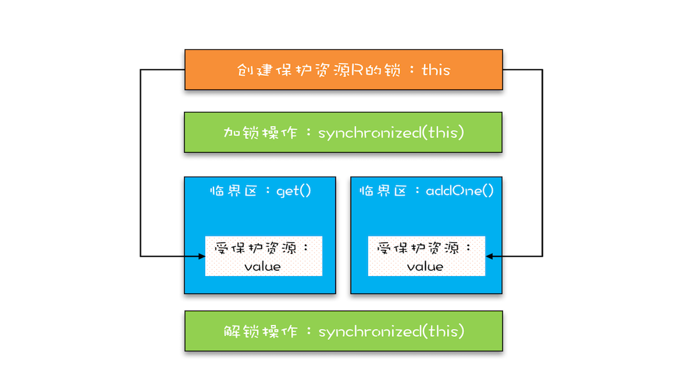
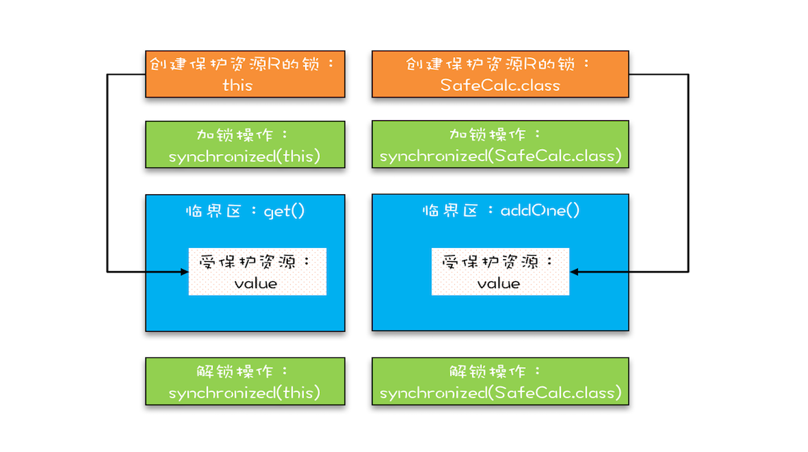
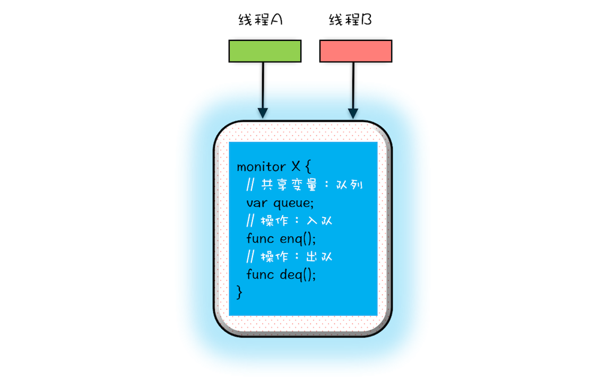
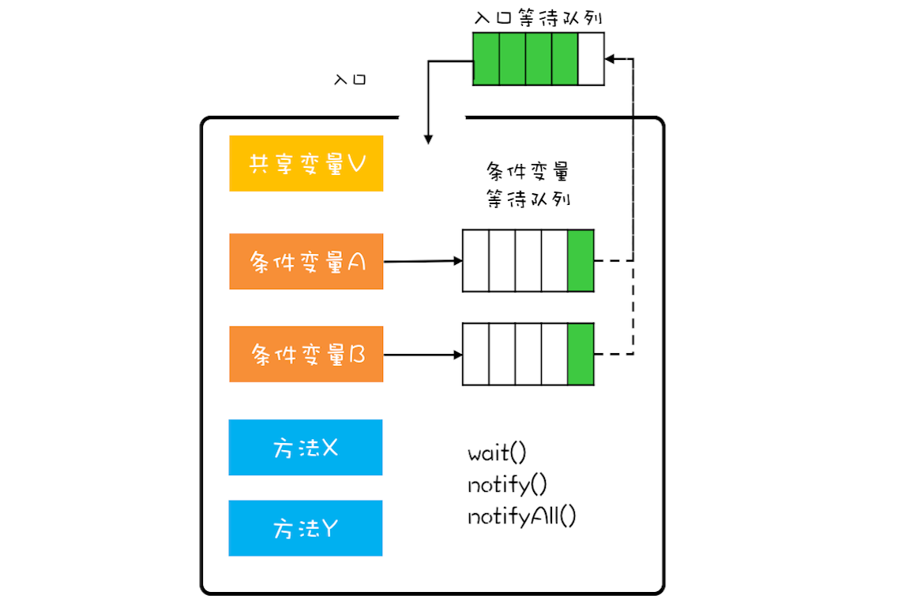

**并发编程可以总结为三个核心问题：分工、同步、互斥。**

所谓**分工**指的是如何高效地拆解任务并分配给线程，而**同步**指的是线程之间如何协作，**互斥**则是保证同一时刻只允许一个线程访问共享资源

多线程并发产生问题的原因：

- **可见性**问题：缓存。CPU缓存、线程局部缓存
- **原子性**问题：线程切换。
- **有序性**问题：编译优化


解决方法：按需禁用缓存和编译优化


# 针对可见性和有序性

## Java内存模型

## volatile、synchronized、final 关键字

## Happens-Before规则

前面的一个操作的结果对后续操作是可见的

包含的规则（关于可见性）

1. 程序的顺序性规则

   在一个线程中，按照程序顺序，前面的操作 Happens-Before 于后续的任意操作。

2. `volatile` 变量规则

   对一个`volatile`变量的写操作，Happens-before于后续对这个volatile变量的读操作。

3. 传递性

   如果 A Happens-Before B，且 B Happens-Before C，那么 A Happens-Before C。

4. 管程中的锁规则

   对一个锁的解锁Happens-Before 对于后续这个锁的加锁。是同一个锁。

   管程是一种通用的同步原语，在 Java 中指的就是 synchronized，synchronized 是 Java 里对管程的实现。

5. 线程`start()` 规则

   这条是关于线程启动的。它是指主线程 A 启动子线程 B 后，子线程 B 能够看到主线程在启动子线程 B 前的操作。

6. 线程`join()`规则

   是关于线程等待的。它是指主线程 A 等待子线程 B 完成（主线程 A 通过调用子线程 B 的 join() 方法实现），当子线程 B 完成后（主线程 A 中 join() 方法返回），主线程能够看到子线程的操作。当然所谓的“看到”，指的是对共享变量的操作。

7. 线程中断规则

   对线程`interrupt()`方法的调用先行发生于被中断线程的代码检测到中断事件的发生，可以通过`Thread.interrupted()`方法检测到是否有中断发生。

8. 对象终结规则

   一个对象的初始化完成(构造函数执行结束)先行发生于它的`finalize()`方法的开始。

Java内存模型底层怎么实现的？主要是通过`内存屏障(memory barrier)`禁止重排序的，即时编译器根据具体的底层体系架构，将这些内存屏障替换成具体的 CPU 指令。对于编译器而言，内存屏障将限制它所能做的重排序优化。而对于处理器而言，内存屏障将会导致缓存的刷新操作。比如，对于volatile，编译器将在volatile字段的读写操作前后各插入一些内存屏障。

# 针对原子性问题


加锁，临界区 

Java Synchronized关键字

下面两段代码。第一段代码使用 this 这把锁来保护value 资源；第二段代码get 使用了this 这把锁，`addOne`使用了`SafeCalc.class` 这把锁，所以可能产生并发问题。对应下面的图一和图二。

- 代码片段一

```java
class SafeCalc {
  long value = 0L;
  synchronized long get() {
    return value;
  }
  synchronized void addOne() {
    value += 1;
  }
}
```

- 代码片段二

```java
class SafeCalc {
  static long value = 0L;
  synchronized long get() {
    return value;
  }
  synchronized static void addOne() {
    value += 1;
  }
}
```

第一段代码对应的图片



第二段代码对应的图片




# 锁对应资源

## 保护没有关联关系的多个资源

对资源进行分类，对对应的类资源设置不同的锁。例如取款、查询余额归类于一类锁，更改密码、查询密码作为一类锁等。

## 保护有关联关系的多个资源

粒度比较大的锁，覆盖所有相关的资源


死锁的条件

1. 互斥，共享资源 X 和 Y 只能被一个线程占用；
2. 占有且等待，线程` T1` 已经取得共享资源 X，在等待共享资源 Y 的时候，不释放共享资源 X；
3. 不可抢占，其他线程不能强行抢占线程 `T1` 占有的资源；
4. 循环等待，线程 `T1` 等待线程` T2` 占有的资源，线程` T2` 等待线程` T1 `占有的资源，就是循环等待。


并发编程关注的三个地方：

1. 安全性问题
2. 活跃性问题
3. 性能问题


管程，指的是管理共享变量以及对共享变量的操作过程，让他们支持并发。

- 解决互斥问题

  将共享变量以及对共享变量的操作统一封装起来

  （将线程不安全的操作对象以及操作方法封装起来）。例如，将线程不安全的低劣封装起来，对外提供线程安全的操作方法，例如入队操作和出队操作。

  

- 解决同步问题

  

  

- 


