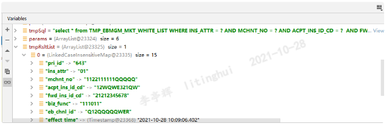

# `LinkedCaseInsensitiveMap` 

## `LinkedCaseInsensitiveMap` 大小写不敏感

在公司`debug`的时候，发现`Map<String,Object>` 类型的`Map` 对于大小写不敏感，后来看到`IDEA` 中对象的类型是`LinkedCaseInsensitiveMap`类型。`LinkedCaseInsensitiveMap`继承于`LinkedHashMap`，`LinkedCaseInsensitiveMap`可以检测关键字（不区分大小写）的唯一性，源码如下。




`LinkedCaseInsensitiveMap`中有两个属性`LinkedHashMap<String,V> targetMap`和`HashMap<String,String> caseInsensitiveMap`。

输入值`Key,Value`， `CaseInsensitveMap`存储`小写Key, Key`，`targetMap` 存储`Key,Value`。

**源码**

```java
public class LinkedCaseInsensitiveMap<V> implements Map<String, V>, Serializable, Cloneable {

	private final LinkedHashMap<String, V> targetMap;

	private final HashMap<String, String> caseInsensitiveKeys;

	private final Locale locale;

	@Nullable
	private transient volatile Set<String> keySet;

	@Nullable
	private transient volatile Collection<V> values;

	@Nullable
	private transient volatile Set<Entry<String, V>> entrySet;
    
    /**
    * caseInsensitiveKeys(HashMap类型) 将Key转换为小写，caseInsensitiveKeys存储 小写key -- Key
    * targetMap(LinkedHashMap类型) Key -- Value
    * 实例： 
    * put("ABCDEF",2)
    * caseInsensitiveKeys: abcdef-->ABCDEF
    * targetMap: ABCDEF--> 2
    */
    @Override
	@Nullable
	public V put(String key, @Nullable V value) {
		String oldKey = this.caseInsensitiveKeys.put(convertKey(key), key);
		V oldKeyValue = null;
		if (oldKey != null && !oldKey.equals(key)) {
			oldKeyValue = this.targetMap.remove(oldKey);
		}
		V oldValue = this.targetMap.put(key, value);
		return (oldKeyValue != null ? oldKeyValue : oldValue);
	}
    
    @Override
	@Nullable
	public V get(Object key) {
		if (key instanceof String) {
			String caseInsensitiveKey = this.caseInsensitiveKeys.get(convertKey((String) key));
			if (caseInsensitiveKey != null) {
				return this.targetMap.get(caseInsensitiveKey);
			}
		}
		return null;
	}
    
    protected String convertKey(String key) {
		return key.toLowerCase(getLocale());
	}
    
}
```

