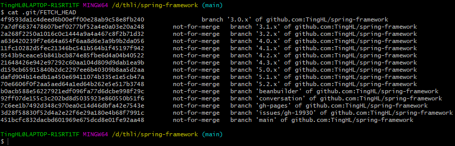
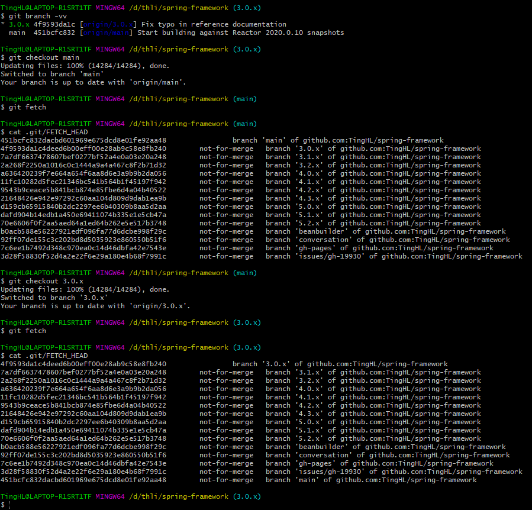
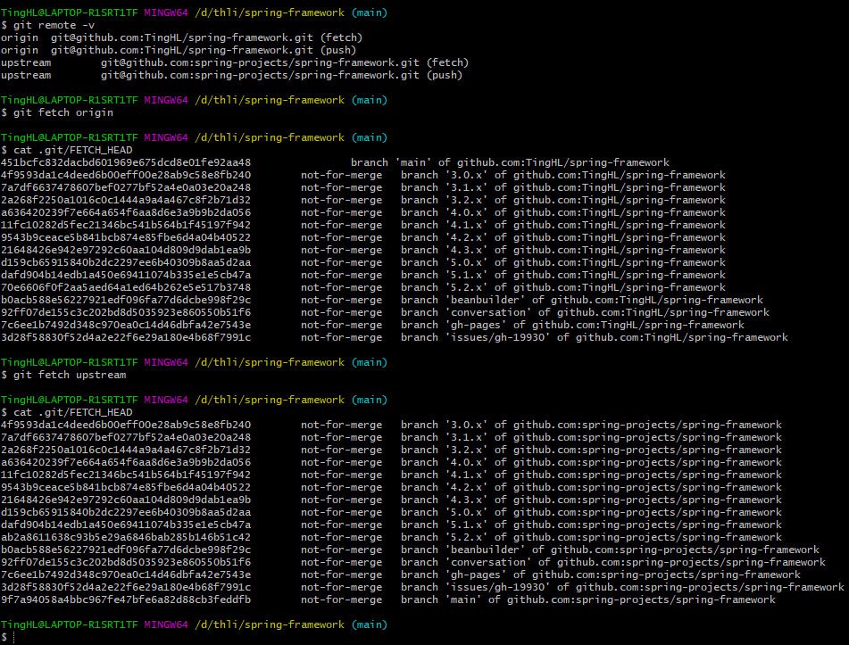
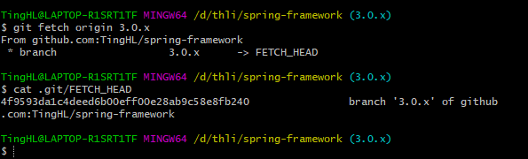
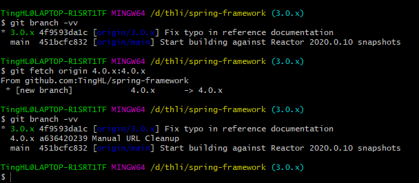

参考链接：

- https://www.cnblogs.com/Venom/p/5477367.html
- https://www.jianshu.com/p/a5c4d2f99807
- https://ruby-china.org/topics/4768
- 

# Git Fetch

理解 `fetch` 的关键， 是理解 `FETCH_HEAD`。

`FETCH_HEAD`指的是： `某个branch在服务器上的最新状态`。每一个执行过`fetch`操作的项目都会存在一个`FETCH_HEAD`列表， 
这个列表保存在 `.git/FETCH_HEAD` 文件中， 其中每一行对应于远程服务器的一个分支。
**`FETCH_HEAD`当前指向的远程分支就是这个文件第一行对应的那个分支**。如下图所示，当前`FETCH_HEAD` 指向远程分支 `3.0.x`。

## 常用方法

常见的`git fetch` 使用方式包含以下四种：

### **`git fetch`**

这一步其实是执行了两个关键操作：
第一步：创建并更新所有远程分支的本地远程分支。即创建并更新`origin/xxx`分支，拉取代码到`origin/xxx`分支上。
第二步：设定`FETCH_HEAD`为远程服务器的`origin/当前分支`。例如，当前分支为`main` 分支，`git fetch`命令后，`FETCH_HEAD`对应`origin/main`。后期可以使用`git merge FETCH_HEAD`命令，合并本地`main` 分支和`FETCH_HEAD`远程拉取下来的`origin/main`。

需要注意的是： 和`push`不同， `fetch`会自动获取远程新加入的分支，拉取当前项目的所有分支的`commit`。

### **`git fetch origin`**

同上， 只不过手动指定了remote。

### **`git fetch origin branch1`**

设定当前分支的 `FETCH_HEAD` 为远程服务器的`branch1`分支。

注意： 在这种情况下， 不会在本地创建本地远程分支， 这是因为：

这个操作是`git pull origin branch1`的第一步， 而对应的`pull`操作，并不会在本地创建新的`branch`。

一个附加效果是：

这个命令可以用来测试远程主机的远程分支`branch1`是否存在， 如果存在， 返回0， 如果不存在， 返回128， 抛出一个异常。

### **`git fetch origin branch1:branch2`**

只要明白了上面的含义， 这个就很简单了，

- 首先执行上面的`fetch`操作

- 使用远程`branch1`分支在本地创建`branch2`(但不会切换到该分支)， 
  如果本地不存在`branch2`分支， 则会自动创建一个新的`branch2`分支， 
  如果本地存在`branch2`分支， 并且是`fast forward`， 则自动合并两个分支， 否则， 会阻止以上操作。
  
  
  
  

# Git Pull

只要理解了`git fetch`， `git pull`就太简单了。

`git pull` 等价于以下两步：

- 经命令中的`pull`换成`fetch`， 执行
- `git merge FETCH_HEAD`
