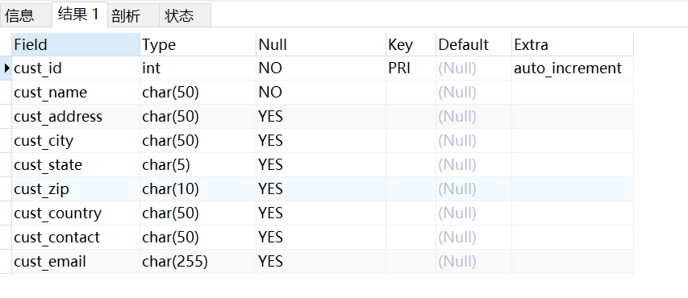
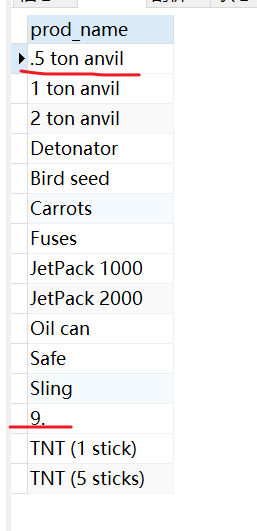
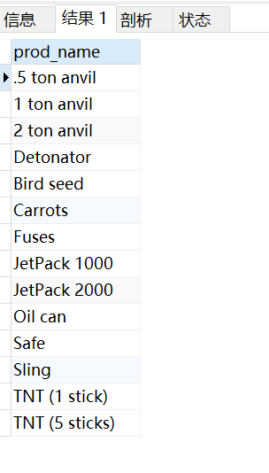
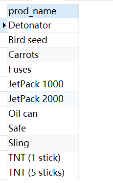
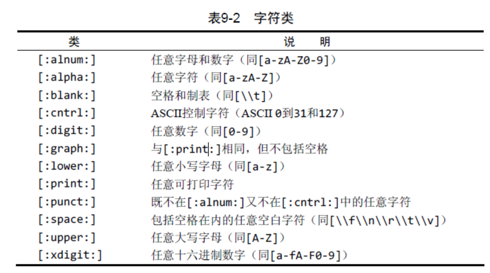
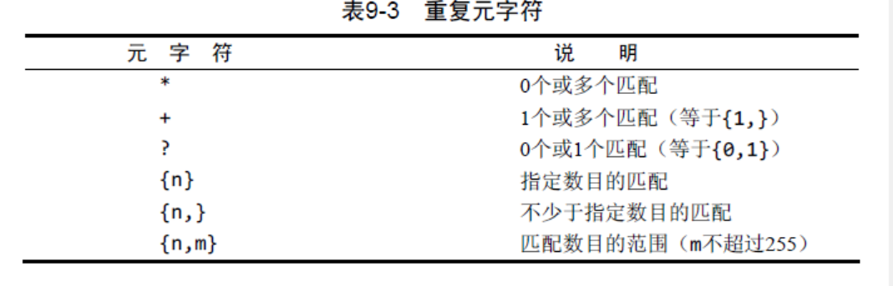
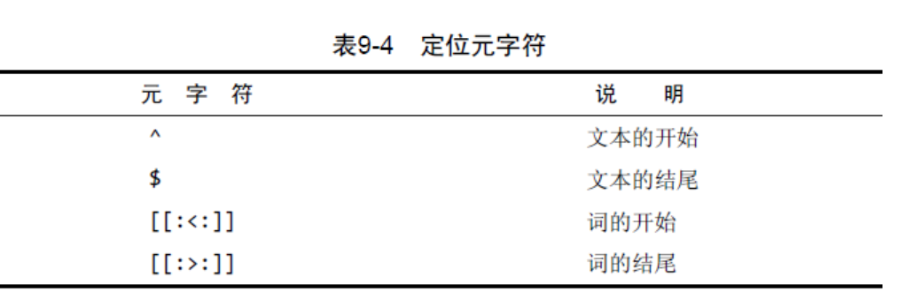

参考资料：

- `MySQL`必知必会

# Mysql 基本概念

## 数据库

数据库（database） 保存有组织的数据的容器（通常是一个文件或一组文件）。

## 表

表（table） 某种特定类型数据的结构化清单。

## 模式

模式（schema） 关于数据库和表的布局及特性的信息。

## 主键

主键（primary key）：一列（或一组列），其值能够唯一区分表中每个行。表中的任何列都可以作为主键，只要它满足以下条件：

- 任意两行都不具有相同的主键值；
- **每个行都必须具有一个主键值（主键列不允许NULL值）。**

应该坚持的几个普遍认可的最好习惯为：

- 不更新主键列中的值；
- 不重用主键列的值；
- 不在主键列中使用可能会更改的值。（例如，如果使用一个名字作为主键以标识某个供应商，当该供应商合并和更改其名字时，必须更改这个主键。）

# DBMS

数据的所有存储、检索、管理和处理实际上是由数据库软件——DBMS（数据库管理系统）完成的。MySQL是一种DBMS，即它是一种数据库软件。

DBMS可分为两类：一类为基于共享文件系统的DBMS，另一类为基于客户机—服务器的DBMS。前者（包括诸如Microsoft Access和FileMaker）用于桌面用途，通常不用于高端或更关键的应用。MySQL、Oracle以及Microsoft SQL Server等数据库是基于客户机—服务器的数据库。客户机—服务器应用分为两个不同的部分。服务器部分是负责所有数据访问和处理的一个软件。这个软件运行在称为数据库服务器的计算机上。与数据文件打交道的只有服务器软件。关于数据、数据添加、删除和数据更新的所有请求都由服务器软件完成。这些请求或更改来自运行客户机软件的计算机。客户机是与用户打交道的软件。

# 常用命令

## 显示所有数据库

```mysql
show databases;
```

## 显示所有表

```mysql
show tables;
```

## 显示具体一个表中的所有列

```mysql
show columns from <table_name>;
describe <table_name>;
```



## 显示服务器的状态信息

```mysql
show status;
```

## 显示创建特定数据库或表的MySQL语句

```mysql
show create table <table_name>;
show create database <database_name>;
```

## 显示授予用户的安全权限

```mysql
show grants;
```

## 显示服务器错误或警告信息

```mysql
show errors;
show warnings;
```

# 关键字

## DISTINCT

不能部分使用DISTINCT，DISTINCT关键字应用于所有列而不仅仅是它的前置列。

可以使用具有多个列的`DISTINCT`子句。 在这种情况下，`MySQL`使用所有列的组合来确定结果集中行的唯一性。

```mysql
# 取不同的column_1
select distinct <column_1> from <tbl_name>;
# 除非指定的两个列都不同，否则所有的行都会被检索出来
select distinct <column_1,column_2> from <tbl_name>;
```

## LIMIT

根据查询条件查询一定数量的数据**（limit 后只有一个参数）**

```mysql
# 根据查询条件 检索出<record_nums>条数据 
select <column_name> from <table_name> limit <record_nums>;
```

限定返回数据的位置，及其后面显示的行数。**（limit后有两个参数）**

start_position: 检索出来的第一行为第0行，开始检索的位置

record_nums: 检索出的数据条数

```mysql
# 从行<start_position>开始 检索出<record_nums>行
select <column_name>
from <table_name> 
limit <start_position>,<record_nums>;
```

## ORDER BY

通常，ORDER BY子句中使用的列将是为显示所选择的列。但是，实际上并不一定要这样，用非检索的列排序数据是完全合法的。

## WHERE

### 空值检查NULL

```mysql
# IS NULL 子句
select <column_name> from <table_name> where <column_name> IS NULL;
```

**NULL与不匹配** 在通过过滤选择出不具有特定值的行时，你可能希望返回具有NULL值的行。但是，不行。因为未知具有特殊的含义，数据库不知道它们是否匹配，所以在匹配过滤或不匹配过滤时不返回它们。因此，在过滤数据时，一定要验证返回数据中确实给出了被过滤列具有NULL的行。

### AND OR

AND的优先级高于OR优先级

```mysql
# 优先处理AND操作符
# 含义：由供应商1003制造的任何价格为10美元（含）以上的产品或者由供应商1002制造的任何产品
select prod_name,prod_price
from products
where vend_id=1002 or vend_id = 1003 and prod_price>=10; 
# and 是一个二元运算符，相当于在and表达式的运算对象周围使用了小括号
# where vend_id=1002 or (vend_id=1003 and prod_proce>=10)
```

## % 通配符

- 除了一个或多个字符外，%还能匹配0个字符。%代表搜索模式中给定位置的0个、1个或多个字符。
- 虽然似乎%通配符可以匹配任何东西，但有一个例外，即NULL。即使是WHERE prod_name LIKE '%'也不能匹配用值NULL作为产品名的行。

## 下划线_ 通配符

- 下划线的用途与%一样，但下划线只匹配单个字符而不是多个字符。

# 正则表达式

**正则表达式匹配的是列值，LIKE匹配的是整个列**（列值从列值的某一个位置开始验证是否符合规则，整个列是从0验证是否匹配规则）。示例：

prod_name全部数据，如下图所示：



```mysql
# 在列值中匹配具有非数字 非特殊字符. 的列（显示列值中符合这个条件的数据，例如 .5 ton anvil）
select prod_name from products
where prod_name regexp '[^0-9\\.]'
```



```mysql
# 在列值中匹配 非数字非特殊字符. 开头的数字
select prod_name
from products where prod_name regexp '^[^0-9\\.]'
```



## 否定 / 开始  ^

^有两种用法。在集合中（用`[` `]`定义），用它来否定该集合，否则，用来指串的开始处。


## 匹配特殊字符 `\\`为前导

```mysql
# 查找 特殊字符 - 
select vend_name from venders where vend_name regexp '\\-'
```

## 匹配字符类





定位元字符匹配特定位置的文本。



# 计算字段

## 拼接字段

concat() 函数：一个或多个指定的串，各个串之间用逗号分隔。

```mysql
select concat(vend_name,'(',vend_country,')')
from vendors order by vend_name;
```

# 函数

## 文本函数

| 函 数                                                        | 说 明 |
| ------------------------------------------------------------ | :---- |
|Left() |返回串左边的字符|
|Length()| 返回串的长度|
|Locate()| 找出串的一个子串|
|Lower() |将串转换为小写|
|LTrim()| 去掉串左边的空格|
|Right()| 返回串右边的字符|
|RTrim() |去掉串右边的空格|
|Soundex()| 返回串的SOUNDEX值，将任何文本字符串转换为描述其语音表示的字母数字模式的算法 |
|SubString()| 返回子串的字符|
|Upper()| 将串转换为大写|


## 数值函数

数值处理函数仅处理数值数据。这些函数一般主要用于代数、三角
或几何运算，因此没有串或日期—时间处理函数的使用那么频繁。

| 函 数 | 说 明 |
| ----- | ----- |
|Abs() |返回一个数的绝对值|
|Cos() |返回一个角度的余弦|
|Exp() |返回一个数的指数值|
|Mod()| 返回除操作的余数|
|Pi() |返回圆周率|
|Rand()| 返回一个随机数|
|Sin() |返回一个角度的正弦|
|Sqrt()| 返回一个数的平方根|
|Tan()| 返回一个角度的正切|

## 日期和时间函数

日期和时间采用相应的数据类型和特殊的格式存储，以便能快速和有效地排序或过滤，并且节省物理存储空间。

|函 数 |说 明|
|------|------|
|AddDate()| 增加一个日期（天、周等）|
|AddTime()| 增加一个时间（时、分等）|
|CurDate() |返回当前日期|
|CurTime() |返回当前时间|
|Date() |返回日期时间的日期部分。例如Date('2005-09-01 11:30:05') 取值为 '2005-09-01'。|
|DateDiff() |计算两个日期之差|
|Date_Add() |高度灵活的日期运算函数|
|Date_Format() |返回一个格式化的日期或时间串|
|Day() |返回一个日期的天数部分|
|DayOfWeek()| 对于一个日期，返回对应的星期几|
|Hour() |返回一个时间的小时部分|
|Minute() |返回一个时间的分钟部分|
|Month() |返回一个日期的月份部分|
|Now() |返回当前日期和时间|
|Second()| 返回一个时间的秒部分|
|Time() |返回一个日期时间的时间部分|
|Year() |返回一个日期的年份部分|


## 聚集函数

| 函 数 | 说 明 |
| ----- | ----- |
|AVG() |返回某列的平均值. AVG()通过对表中行数计数并计算特定列值之和，求得该列的平均值。AVG()可用来返回所有列的平均值，也可以用来返回特定列或行的平均值。AVG()函数忽略列值为NULL的行(不加和 不平均 忽略该行数据)。|
|COUNT()| 返回某列的行数.<br/>使用COUNT(*)对表中行的数目进行计数，不管表列中包含的是空值（NULL）还是非空值。<br/>使用COUNT(column)对特定列中具有值的行进行计数，忽略NULL值。 |
|MAX()| 返回某列的最大值. MAX()函数忽略列值为NULL的行。 |
|MIN() |返回某列的最小值. MIN()函数忽略列值为NULL的行。|
|SUM() |返回某列值之和. SUM()函数忽略列值为NULL的行。|

利用标准的算术操作符，所有聚集函数都可用来执行多个列上的计算。

例如:

```mysql
select sum(item_price*item_quantity) as total_price
from orderitems
where order_num=20005;
```

以上5个聚集函数都可以如下使用：

- 对所有的行执行计算，指定ALL参数或不给参数（因为ALL是默认行为）；
- 只包含不同的值，指定DISTINCT参数。

# group by 分组, having 过滤

GROUP BY子句指示MySQL分组数据，然后对每个组而不是整个结果集进行聚集。
在具体使用GROUP BY子句前，需要知道一些重要的规定。

- GROUP BY子句可以包含任意数目的列。这使得能对分组进行嵌套，为数据分组提供更细致的控制。
- 如果在GROUP BY子句中嵌套了分组，数据将在最后规定的分组上进行汇总。换句话说，在建立分组时，指定的所有列都一起计算（所以不能从个别的列取回数据）。
- GROUP BY子句中列出的每个列都必须是检索列或有效的表达式（但不能是聚集函数）。如果在SELECT中使用表达式，则必须在GROUP BY子句中指定相同的表达式。不能使用别名。
- **除聚集计算语句外，SELECT语句中的每个列都必须在GROUP BY子句中给出**。
- 如果分组列中具有NULL值，则NULL将作为一个分组返回。如果列中有多行NULL值，它们将分为一组。
- GROUP BY子句必须出现在WHERE子句之后，ORDER BY子句之前。

**在MYSQL中使用GROUP BY对表中的数据进行分组时，**
**GROUP BY X意思是将所有具有相同X字段值的记录放到一个分组里，**
**GROUP BY X, Y意思是将所有具有相同X字段值和Y字段值的记录放到一个分组里。**

ORDER BY与GROUP BY 差别

| ORDER BY | GROUP BY |
| -------- | -------- |
|排序产生的输出| 分组行。但输出可能不是分组的顺序|
|任意列都可以使用（甚至非选择的列也可以使用）|**只可能使用选择列或表达式列，而且必须使用每个选择列表达式**|
|不一定需要 |如果与聚集函数一起使用列（或表达式），则必须使用|


# 联结

联结：多个表之间关联

笛卡儿积（cartesian product） 由没有联结条件的表关系返回的结果为笛卡儿积。检索出的行的数目将是第一个表中的行数乘以第二个表中的行数。

## 内部联结（等值连接）

基于两个表之间的相等测试

```mysql
select *
from <table_name1> inner join <table_name1> 
on <table_name1>.column = <table_name2>.column;

select * from <table_name1>,<table_name1> 
where <table_name1>.column = <table_name2>.column;
```

## 自联结

## 自然联结

## 外部联结

# 组合查询

许执行多个查询（多条SELECT语句），并将结果作为单个查询结果集返回。有两种基本情况，其中需要使用组合查询：

- 在单个查询中从不同的表返回类似结构的数据；
- 对单个表执行多个查询，按单个查询返回数据。

UNION的使用很简单。所需做的只是给出每条SELECT语句，在各条语句之间放上关键字UNION。

**Union规则**

- UNION必须由两条或两条以上的SELECT语句组成，语句之间用关键字UNION分隔（因此，如果组合4条SELECT语句，将要使用3个UNION关键字）。
- UNION中的每个查询必须包含相同的列、表达式或聚集函数（不过各个列不需要以相同的次序列出）。
- 列数据类型必须兼容：类型不必完全相同，但必须是DBMS可以隐含地转换的类型（例如，不同的数值类型或不同的日期类型）。

**UNION ALL**

使用UNION ALL，MySQL不取消重复的行。

**组合查询结果排序**

SELECT语句的输出用ORDER BY子句排序。在用UNION组合查询时，只能使用一条ORDER BY子句，它必须出现在最后一条SELECT语句之后。


# 全文索引

为了进行全文索引，MySQL根据子句FULLTEXT(note_text)的指示对它进行索引。FULLTEXT 索引单个列，也可以指定多个列。

```mysql
CREATE TABLE `productnotes2` (
  `note_id` int NOT NULL AUTO_INCREMENT,
  `prod_id` char(10) NOT NULL,
  `note_date` datetime NOT NULL,
  `note_text` text,
  PRIMARY KEY (`note_id`),
  FULLTEXT KEY `note_text` (`note_text`)
) ENGINE=InnoDB AUTO_INCREMENT=115 DEFAULT CHARSET=utf8mb4 COLLATE=utf8mb4_0900_ai_ci
```

在定义之后，MySQL 自动维护改索引。在增加、更新或删除行时，索引随之自动更新。

## Match() Against()

使用Match()和Against() 执行全文搜索，Match() 指定被索引的列，Against()指定要使用的索引表达式。

```mysql
select note_text
from productnotes
where match(note_text) against('rabit');
```

使用完整的Match() 说明 传递给Match() 的值必须与FULLTEXT()定义中的相同。如果指定多个列，则必须列出它们（而且次序正确）。

## 拓展查询

在使用查询扩展时，MySQL对数据和索引进行两遍扫描来完成搜索：

- 首先，进行一个基本的全文本搜索，找出与搜索条件匹配的所有行；
- 其次，MySQL检查这些匹配行并选择所有有用的词。
- 再其次，MySQL再次进行全文本搜索，这次不仅使用原来的条件，而且还使用所有有用的词。

```mysql
select note_text
from productnotes
where match(note_text) against('rabit') with query expansion;
```

## 布尔文本搜索

以布尔方式，可以提供关于如下内容的细节：

- 要匹配的词；
- 要排斥的词（如果某行包含这个词，则不返回该行，即使它包含其他指定的词也是如此）；
- 排列提示（指定某些词比其他词更重要，更重要的词等级更高）；
- 表达式分组；
- 另外一些内容。

```mysql
select note_text
from productnotes
where match(note_text) Against('heavy' IN BOOLEAN MODE);

# 匹配heavey 但 -rope*明确地指示MySQL 排除包含rope*
select note_text
from productnotes
where match(note_text) Against('heavy -rope*' IN BOOLEAN MODE);
```


全文布尔操作符

|布尔操作符 |说 明|
|----|----|
|+ |包含，词必须存在|
|-| 排除，词必须不出现|
|> |包含，而且增加等级值|
|>| < 包含，且减少等级值|
|() |把词组成子表达式（允许这些子表达式作为一个组被包含、排除、排列等）|
|~ |取消一个词的排序值|
|* |词尾的通配符|
|"" |定义一个短语（与单个词的列表不一样，它匹配整个短语以便包含或排除这个短语）|

# 插入数据

```mysql
# 普通
INSERT INTO <table_name>(column1,column2,...)
values(value1,value2,...),(value11,value22,...);

# 有插入查询能力支持
INSERT [LOW_PRIORITY | HIGH_PRIORITY] [IGNORE]
    [INTO] tbl_name
    [PARTITION (partition_name [, partition_name] ...)]
    [(col_name [, col_name] ...)]
    {SELECT ... | TABLE table_name}
    [ON DUPLICATE KEY UPDATE assignment_list]

value:
    {expr | DEFAULT}

assignment:
    col_name = value

assignment_list:
    assignment [, assignment] ...
```

INSERT SELECT中的列名 为简单起见，这个例子在INSERT和SELECT语句中使用了相同的列名。但是，不一定要求列名匹配。事实上，MySQL甚至不关心SELECT返回的列名。它使用的是列的位置，因此SELECT中的第一列（不管其列名）将用来填充表列中指定的第一个列，第二列将用来填充表列中指定的第二个列，如此等等。这对于从使用不同列名的表中导入数据是非常有用的。

# 更新数据

基本的
UPDATE语句由3部分组成，分别是：

- 要更新的表；
- 列名和它们的新值；
- 确定要更新行的过滤条件。

```mysql
# single table Syntax
UPDATE [LOW_PRIORITY] [IGNORE] table_reference
    SET assignment_list
    [WHERE where_condition]
    [ORDER BY ...]
    [LIMIT row_count]

value:
    {expr | DEFAULT}

assignment:
    col_name = value

assignment_list:
    assignment [, assignment] ...
    

# multiple-talbe syntax
UPDATE [LOW_PRIORITY] [IGNORE] table_references
    SET assignment_list
    [WHERE where_condition]
```

IGNORE 关键字 如果用UPDATE语句更新多行，并且在更新这些行中的一行或多行时出一个现错误，则整个UPDATE操作被取消（错误发生前更新的所有行被恢复到它们原来的值）。为即使是发生错误，也继续进行更新，可使用IGNORE关键字，如下所示：`UPDATE IGNORE customers…`

# 删除数据

为了从一个表中删除（去掉）数据，使用DELETE语句。可以两种方式使用DELETE：

- 从表中删除特定的行；
- 从表中删除所有行。

省略了WHERE子句，则UPDATE或DELETE将被应用到表中所有的行。换句话说，如果执行UPDATE而不带WHERE子句，则表中每个行都将用新值更新。类似地，如果执行DELETE语句而不带WHERE子句，表的所有数据都将被删除。

**更快的删除** 如果想从表中删除所有行，不要使用DELETE。可使用TRUNCATE TABLE语句，它完成相同的工作，但速度更快（TRUNCATE实际是删除原来的表并重新创建一个表，而不是逐行删除表中的数据）

# 更新表

```mysql
ALTER TABLE tbl_name
    [alter_option [, alter_option] ...]
    [partition_options]

alter_option: {
    table_options
  | ADD [COLUMN] col_name column_definition
        [FIRST | AFTER col_name]
  | ADD [COLUMN] (col_name column_definition,...)
  | ADD {INDEX | KEY} [index_name]
        [index_type] (key_part,...) [index_option] ...
  | ADD {FULLTEXT | SPATIAL} [INDEX | KEY] [index_name]
        (key_part,...) [index_option] ...
  | ADD [CONSTRAINT [symbol]] PRIMARY KEY
        [index_type] (key_part,...)
        [index_option] ...
  | ADD [CONSTRAINT [symbol]] UNIQUE [INDEX | KEY]
        [index_name] [index_type] (key_part,...)
        [index_option] ...
  | ADD [CONSTRAINT [symbol]] FOREIGN KEY
        [index_name] (col_name,...)
        reference_definition
  | ADD [CONSTRAINT [symbol]] CHECK (expr) [[NOT] ENFORCED]
  | DROP {CHECK | CONSTRAINT} symbol
  | ALTER {CHECK | CONSTRAINT} symbol [NOT] ENFORCED
  | ALGORITHM [=] {DEFAULT | INSTANT | INPLACE | COPY}
  | ALTER [COLUMN] col_name {
        SET DEFAULT {literal | (expr)}
      | SET {VISIBLE | INVISIBLE}
      | DROP DEFAULT
    }
  | ALTER INDEX index_name {VISIBLE | INVISIBLE}
  | CHANGE [COLUMN] old_col_name new_col_name column_definition
        [FIRST | AFTER col_name]
  | [DEFAULT] CHARACTER SET [=] charset_name [COLLATE [=] collation_name]
  | CONVERT TO CHARACTER SET charset_name [COLLATE collation_name]
  | {DISABLE | ENABLE} KEYS
  | {DISCARD | IMPORT} TABLESPACE
  | DROP [COLUMN] col_name
  | DROP {INDEX | KEY} index_name
  | DROP PRIMARY KEY
  | DROP FOREIGN KEY fk_symbol
  | FORCE
  | LOCK [=] {DEFAULT | NONE | SHARED | EXCLUSIVE}
  | MODIFY [COLUMN] col_name column_definition
        [FIRST | AFTER col_name]
  | ORDER BY col_name [, col_name] ...
  | RENAME COLUMN old_col_name TO new_col_name
  | RENAME {INDEX | KEY} old_index_name TO new_index_name
  | RENAME [TO | AS] new_tbl_name
  | {WITHOUT | WITH} VALIDATION
}

partition_options:
    partition_option [partition_option] ...

partition_option: {
    ADD PARTITION (partition_definition)
  | DROP PARTITION partition_names
  | DISCARD PARTITION {partition_names | ALL} TABLESPACE
  | IMPORT PARTITION {partition_names | ALL} TABLESPACE
  | TRUNCATE PARTITION {partition_names | ALL}
  | COALESCE PARTITION number
  | REORGANIZE PARTITION partition_names INTO (partition_definitions)
  | EXCHANGE PARTITION partition_name WITH TABLE tbl_name [{WITH | WITHOUT} VALIDATION]
  | ANALYZE PARTITION {partition_names | ALL}
  | CHECK PARTITION {partition_names | ALL}
  | OPTIMIZE PARTITION {partition_names | ALL}
  | REBUILD PARTITION {partition_names | ALL}
  | REPAIR PARTITION {partition_names | ALL}
  | REMOVE PARTITIONING
}

key_part: {col_name [(length)] | (expr)} [ASC | DESC]

index_type:
    USING {BTREE | HASH}

index_option: {
    KEY_BLOCK_SIZE [=] value
  | index_type
  | WITH PARSER parser_name
  | COMMENT 'string'
  | {VISIBLE | INVISIBLE}
}

table_options:
    table_option [[,] table_option] ...

table_option: {
    AUTOEXTEND_SIZE [=] value
  | AUTO_INCREMENT [=] value
  | AVG_ROW_LENGTH [=] value
  | [DEFAULT] CHARACTER SET [=] charset_name
  | CHECKSUM [=] {0 | 1}
  | [DEFAULT] COLLATE [=] collation_name
  | COMMENT [=] 'string'
  | COMPRESSION [=] {'ZLIB' | 'LZ4' | 'NONE'}
  | CONNECTION [=] 'connect_string'
  | {DATA | INDEX} DIRECTORY [=] 'absolute path to directory'
  | DELAY_KEY_WRITE [=] {0 | 1}
  | ENCRYPTION [=] {'Y' | 'N'}
  | ENGINE [=] engine_name
  | ENGINE_ATTRIBUTE [=] 'string'
  | INSERT_METHOD [=] { NO | FIRST | LAST }
  | KEY_BLOCK_SIZE [=] value
  | MAX_ROWS [=] value
  | MIN_ROWS [=] value
  | PACK_KEYS [=] {0 | 1 | DEFAULT}
  | PASSWORD [=] 'string'
  | ROW_FORMAT [=] {DEFAULT | DYNAMIC | FIXED | COMPRESSED | REDUNDANT | COMPACT}
  | SECONDARY_ENGINE_ATTRIBUTE [=] 'string'
  | STATS_AUTO_RECALC [=] {DEFAULT | 0 | 1}
  | STATS_PERSISTENT [=] {DEFAULT | 0 | 1}
  | STATS_SAMPLE_PAGES [=] value
  | TABLESPACE tablespace_name [STORAGE {DISK | MEMORY}]
  | UNION [=] (tbl_name[,tbl_name]...)
}

partition_options:
    (see CREATE TABLE options)
```

例子：

- 给表添加一个列

  ```mysql
  alter table vendor add vend_phone char(20);
  ```

- 删掉表的列

  ```mysql
  alter table vendor drop vend_phone;
  ```

- 定义外键

    ```mysql
    alter table orderitems
    add constraint fk_orderitems_orders
    foreign key (order_num) references orders(order_item);
    ```

- 

# 删除表

```mysql
drop table table_names;
```

# 重命名表

```mysql
rename table old_table_name1 to new_table_name1,
[old_table_name2 to new_table_name2,
old_table_name3 to new_table_name3,...];
```


# 视图

## 使用视图的原因

- 重用SQL语句。
- 简化复杂的SQL操作。在编写查询后，可以方便地重用它而不必知道它的基本查询细节。
- 使用表的组成部分而不是整个表。
- 保护数据。可以给用户授予表的特定部分的访问权限而不是整个表的访问权限。 
- 更改数据格式和表示。视图可返回与底层表的表示和格式不同的数据。

## 视图的规则和限制

- 与表一样，视图必须唯一命名（不能给视图取与别的视图或表相同的名字）。
- 对于可以创建的视图数目没有限制。
-  为了创建视图，必须具有足够的访问权限。这些限制通常由数据库管理人员授予。
- 视图可以嵌套，即可以利用从其他视图中检索数据的查询来构造一个视图。
- ORDER BY可以用在视图中，但如果从该视图检索数据SELECT中也含有ORDER BY，那么该视图中的ORDER BY将被覆盖。
- 视图不能索引，也不能有关联的触发器或默认值。
- 视图可以和表一起使用。例如，编写一条联结表和视图的SELECT语句。

## 视图使用

- 视图用CREATE VIEW语句来创建。例子：

  ```mysql
  create view productcustomers 
  as select cust_name,cust_constact,prod_id 
  from customers,orders,orderitems 
  where customers.cust_id=orders.cust_id and orderitems.order_num =orders.order_num;
  ```

- 使用SHOW CREATE VIEW viewname；来查看创建视图的语句。

- 用DROP删除视图，其语法为DROP VIEW viewname;。

- 更新视图时，可以先用DROP再用CREATE，也可以直接用CREATE OR REPLACE VIEW。如果要更新的视图不存在，则第2条更新语句会创建一个视图；如果要更新的视图存在，则第2条更新语句会替换原有视图。

## 视图更新

视图定义中有以下操作，则不能进行视图的更新：

- 分组（使用GROUP BY和HAVING）；
- 联结；
- 子查询；
- 并；
- 聚集函数（Min()、Count()、Sum()等）；
- DISTINCT；
- 导出（计算）列。

# 存储过程

存储过程简单来说，就是为以后的使用而保存的一条或多条MySQL语句的集合。可将其视为批文件，虽然它们的作用不仅限于批处理。

## 执行存储过程

MySQL称存储过程的执行为调用，因此MySQL执行存储过程的`语句为CALL。CALL接受存储过程的名字以及需要传递给它的任意参数。例子：

```mysql
call productpricing(@pricelow,@pricehigh,@priceaverage);
```

其中，执行名为productpricing的存储过程，它计算并返回产
品的最低、最高和平均价格。

## 创建存储过程

例子：

```mysql
create procedure productpricing()
begin
	select avg(prod_price) as priceaverage
	from products;
end;

# 存储过程接收3个参数 pl,ph,pa
# 关键字OUT指出相应的参数用来从存储过程中传出一个值（返回给调用者）

create procedure productpricing(
    out pl decimal(8,2),
    out ph decimal(8,2),
    out pa decimal(8,2)
)
begin
	select Min(prod_price)
	into pl
	from products;
	select Max(prod_price)
	into ph
	from products;
	select Avg(prod_price)
	into pa
	from products
end;
# 调用上述定义的存储过程
call productpricing(@pricelow,@pricehigh,@priceaverage);


# 使用IN 和OUT 参数
create procedure ordertotal(
    in onumber int,
    out ototal decimal(8,2)
)
begin
	select sum(item_price*quantity)
	from orderitems
	where order_num=onumber
	into ototal;
end;
# 调用上述存储过程
call ordertotal(20005,@total);
select @total
```

如果存储过程接受参数，它们将在()中列举出来。此存储过程没有参数，但后跟的()仍然需要。BEGIN和END语句用来限定存储过程体。

MySQL支持IN（传递给存储过程）、OUT（从存储过程传出，如这里所用）和INOUT（对存储过程传入和传出）类型的参数。

所有MySQL的变量都必须以@开始。

## 删除存储过程

例子，`drop procedure productpricing`。

## 智能存储过程

情况：

考虑这个场景。你需要获得与以前一样的订单合计，但需要对合计增加营业税，不过只针对某些顾客（或许是你所在州中那些顾客）。那么，你需要做下面几件事情：

- 获得合计（与以前一样）；
- 把营业税有条件地添加到合计；
- 返回合计（带或不带税）。

```mysql
create procedure ordertotal(
    in onumber int,
    in taxable boolean,
    out ototal decimal(8,2)
)comment 'obtain order total,optionally adding tax'
begin
	--Declare variable for total
	declare total decimal(8,2);
	--declare tax percentage
	declare taxrate int default 6;
	
	--get the order totaol
	select sum(item_price*quantity)
	from orderitems
	where order_num=onumber
	into total;
	
	--if this taxable
	if taxable then
		-- yes so add taxrate to the total
		select total+(total/100*taxrate) into total
	end if;
		
	-- And finally, save to out variable
	select total into ototal;
end;
```

## 检查存储过程

`show create procedure ordertotal`

# 游标

游标（cursor）是一个存储在MySQL服务器上的数据库查询，它不是一条SELECT语句，而是被该语句检索出来的结果集。在存储了游标之后，应用程序可以根据需要滚动或浏览其中的数据。

MySQL游标只能用于存储过程（和函数）。

使用游标的步骤：

- 在能够使用游标前，必须声明（定义）它。这个过程实际上没有检索数据，它只是定义要使用的SELECT语句。
- 一旦声明后，必须打开游标以供使用。这个过程用前面定义的SELECT语句把数据实际检索出来。
- 对于填有数据的游标，根据需要取出（检索）各行。
- 在结束游标使用时，必须关闭游标。

## 创建游标

游标使用DECLARE 语句创建。DECLARE命名游标，并定义
相应的SELECT语句，根据需要带WHERE和其他子句。例子：

```mysql
create procedure processorders()
begin
    -- 定义了declare的游标
	declare ordernumbers cursor
	for 
	select order_num from orders;
	
	OPEN ordernumbers;
	
	CLOSE ordernumbers;
end;
```

## 打开和关闭游标

打开：`open ordernumbers`

关闭：`close ordernumbers`

如果你不明确关闭游标，MySQL将会在到达END语句时自动关闭它。

## 使用游标数据

在一个游标被打开后，可以使用FETCH语句分别访问它的每一行。FETCH指定检索什么数据（所需的列），检索出来的数据存储在什么地方。它还向前移动游标中的内部行指针，使下一条FETCH语句检索下一行（不重复读取同一行）。

- **取单行数据**（第一行）

  ```mysql
  create procedure processorders()
  begin
  	declare o int;
  	
  	declare ordernumbers cursor
  	for
  	select order_num from orders;
  	
  	open ordernumbers;
  	
  	fetch ordernumbers into o;
  	
  	close ordernumbers;
  end;
  ```

- **循环检索数据**

  ```mysql
  create procedure processorders()
  begin
  	declare done boolean default 0;
  	declare o int;
  	
  	declare ordernumbers cursor
  	for 
  	select order_num from orders;
  	
  	open ordernumbers;
  	repeat
  		fetch ordernumbers into o;
  	until done end repeat;
  	
  	close ordernumbers;
  end;
  ```

	- 示例高级处理
	
	```mysql
	create procedure processorders()
	begin
		--Declare a local variable
		declare ordernumbers cursor
		for 
		select order_num from orders;
		--declare continue handler
		declare continue handler for sqlstate '02000' set done=1;
		
		--create table to store the results
		create table if not exists ordertotals(order_num int,total decimal(8,2));
		
		--open the cursor
		open ordernumbers;
		
		--loop through all rows
		repeat
			
			--get order number
			fetch ordernumbers into o;
			--get the total for this order
			call ordertotal(o,1,t);
			
			--insert order and total into ordertotals
			insert into ordertotals(order_num,total)
			values(o,t);
			
			--end of loop
			until done end repeat;
			
			--close the cursor
			close ordernumbers; 
	end;
	```

- 
- 

# 触发器

Mysql 响应以下任意语句而自动执行的一条MySQL语句（或位于BEGIN 和END语句之间的一组语句）：

- DELETE
- INSERT
- UPDATE

## 创建触发器

创建触发器时，需要给出4条信息：

- 唯一的触发器名
- 触发器关联的表
- 触发器应该响应的活动（DELETE、INSERT和UPDATE）
- 触发器何时执行（处理之前或之后）

**保持每个数据库的触发器名唯一 在MySQL 5中，触发器名必须在每个表中唯一，但不是在每个数据库中唯一**。这表示同一数据库中的两个表可具有相同名字的触发器。这在其他每个数据库触发器名必须唯一的DBMS中是不允许的，而且以后的MySQL版本很可能会使命名规则更为严格。因此，现在最好是在数据库范围内使用唯一的触发器名。

触发器**仅支持表**。视图、临时表不支持触发器

触发器创建语句：

```mysql
CREATE
    [DEFINER = user]
    TRIGGER [IF NOT EXISTS] trigger_name
    trigger_time trigger_event
    ON tbl_name FOR EACH ROW
    [trigger_order]
    trigger_body

trigger_time: { BEFORE | AFTER }

trigger_event: { INSERT | UPDATE | DELETE }

trigger_order: { FOLLOWS | PRECEDES } other_trigger_name
```

触发器按每个表每个事件每次地定义，每个表每个事件每次只允许一个触发器。因此，每个表最多支持6个触发器（每条INSERT、UPDATE和DELETE的之前和之后）

## 删除触发器

触发器删除语句

```mysql
DROP TRIGGER [IF EXISTS] [schema_name.]trigger_name
```

## 触发器 NEW与OLD

MySQL 中定义了 NEW 和 OLD，用来表示触发器的所在表中，触发了触发器的那一行数据。

具体地：
在 INSERT 型触发器中，NEW 用来表示将要（BEFORE）或已经（AFTER）插入的新数据；
在 UPDATE 型触发器中，OLD 用来表示将要或已经被修改的原数据，NEW 用来表示将要或已经修改为的新数据；
在 DELETE 型触发器中，OLD 用来表示将要或已经被删除的原数据；
使用方法： NEW.columnName （columnName 为相应数据表某一列名）
另外，OLD 是只读的，而 NEW 则可以在触发器中使用 SET 赋值，这样不会再次触发触发器，造成循环调用。

## INSERT触发器

INSERT触发器在INSERT语句执行之前或之后执行。需要知道以下几点：

- 在INSERT触发器代码内，可引用一个名为NEW的虚拟表，访问被插入的行；
- 在BEFORE INSERT触发器中，NEW中的值也可以被更新（允许更改被插入的值）；
- 对于AUTO_INCREMENT列，NEW在INSERT执行之前包含0，在INSERT执行之后包含新的自动生成值。

​	示例：

```mysql
create trigger neworder after insert on orders for each row select new.order_num;
```

## DELETE触发器

DELETE触发器在DELETE语句执行之前或之后执行。需要知道以下两点：

- 在DELETE触发器代码内，你可以引用一个名为OLD的虚拟表，访
  问被删除的行；
- OLD中的值全都是只读的，不能更新。

  ```mysql
  create trigger deletorder before delete on orders
  for each row
  begin
  	insert into archieve_orders(order_num,order_date,cust_id)
  	values(OLD.order_num,OLD.order_date,OLD.cust_id);
  end;
  ```

## UPDATE触发器

- 在UPDATE触发器代码中，你可以引用一个名为OLD的虚拟表访问以前（UPDATE语句前）的值，引用一个名为NEW的虚拟表访问新更新的值；
-  在BEFORE UPDATE触发器中，NEW中的值可能也被更新（允许更改将要用于UPDATE语句中的值）；
- OLD中的值全都是只读的，不能更新。

```mysql
# 确保州名缩写都是大写的
create trigger updatevendor before update on vendors
for each row set NEW.vend_state=Upper(NEW.vend_state);
```

# 管理事务处理

- 事务（transaction）指一组SQL语句；
- 回退（rollback）指撤销指定SQL语句的过程；
- 提交（commit）指将未存储的SQL语句结果写入数据库表；
- 保留点（savepoint）指事务处理中设置的临时占位符（placeholder），你可以对它发布回退（与回退整个事务处理不同）。

标识事务的开始：`start transaction`

回退（撤销）：`rollback`

事务管理用于管理INSERT、UPDATE和DELETE语句。不能回退CREATE或DROP操作。

```mysql
# 保留点 支持事务回退操作，可以回退到任意保留点位置。保留点在执行一次ROLLBACK或COMMIT之后释放
savepoint delete1;
rollback to delete1;
```

# 全球化和本地化

- **字符集**为字母和符号的集合；
- **编码**为某个字符集成员的内部表示；（字符集以什么样的形式编码）
- **校对**为规定字符如何比较的指令。

```mysql
#查看支持的字符集完整列表
show character set;

#查看支持的校对列表
show collation;

#查看默认的字符集和校对
show variables like 'character%';
show variables like 'collation%';
```


一般，MySQL如下确定使用什么样的字符集和校对。

- 如果指定CHARACTER SET和COLLATE两者，则使用这些值。
- 如果只指定CHARACTER SET，则使用此字符集及其默认的校对（如SHOW CHARACTER SET的结果中所示）。
- 如果既不指定CHARACTER SET，也不指定COLLATE，则使用数据库默认。

```mysql
#指定表使用何种字符集和校对
create table mytable
(
	column1 INT,
    column2 VARCHAR(10)
)DEFAULT CHARACTER SET hebrew
collation hebrew_general_ci;

#使用查询语句时，使用不同的排序校对
select * from customers
order by lastname,firstname collation latin1_general_cs;


```

# 安全管理

MYSQL中有一个名为mysql的数据库，其有一个名为user的表，它包含所有的用户账号。

```mysql
#创建用户账号
create user ben identified by 'p@$$w0rd';

# 重新命名一个用户账号
rename user ben to bforta;

#删除用户账号
drop user bforta;

#查看账户权限
show grants for bforta;
```


