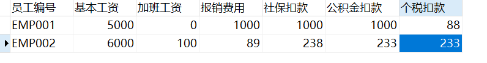
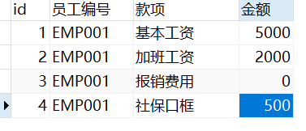
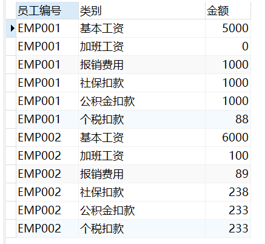
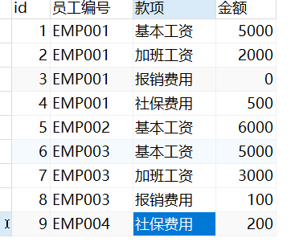
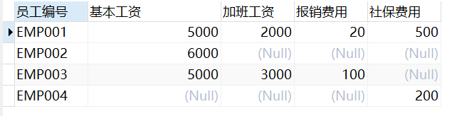

参考链接：  
- [纵表和横表的概念及其相互转换](https://blog.csdn.net/zhangzeyuaaa/article/details/50675058)
- [数据库设计---关于建表的时候选择横表和竖表(纵表)的一点思考](https://www.cnblogs.com/wy123/p/6677073.html)
- 
# 概念
## 横表
普通的建表方式，如表结构：`主键、字段1、字段2、字段3...`。类似于以`Key-value1-value2-value3`的形式存储。

```sql
CREATE TABLE `horizontal_table` (
  `员工编号` char(6) NOT NULL,
  `基本工资` int DEFAULT NULL,
  `加班工资` int DEFAULT NULL,
  `报销费用` int DEFAULT NULL,
  `社保扣款` int DEFAULT NULL,
  `公积金扣款` int DEFAULT NULL,
  `个税扣款` int DEFAULT NULL,
  PRIMARY KEY (`员工编号`)
)
```


## 纵表
纵表后，则表结构为：`主键、字段代码、字段值`。而字段代码则为字段1、字段2、字段3...。  特点是每行进存储某一个实体记录的某一个字段的值，类似于以行的形式`Key-Value`进行存储。


```sql
CREATE TABLE `vertical_table` (
  `id` int NOT NULL AUTO_INCREMENT,
  `员工编号` varchar(6) DEFAULT NULL,
  `款项` varchar(20) DEFAULT NULL,
  `金额` int DEFAULT NULL,
  PRIMARY KEY (`id`)
) ENGINE=InnoDB AUTO_INCREMENT=5 DEFAULT CHARSET=utf8mb4 COLLATE=utf8mb4_0900_ai_ci
```


||横表|纵表|
|----|----|----|
|表结构|主键、字段1、字段2、字段3...|主键、字段代码、字段值|
|优点|一条表示一个实体记录，清晰|给表新增字段，只需要新增一些记录。灵活拓展存储的内容，具有一定的共用性|
|缺点|给表新增字段，必须重构表结构，不方便拓展和公用|数据描述比横表不清晰。如果需要分组统计，需要先group by，较繁琐|
|形式|Key-Value1-Value2-...（一条）|Key-Value1（多条）|
||各个字段的值是自由的|字段的类型是固定的，类型要兼容|
||表中不存储描述性字段本身（相对于纵表）|表中需要存储描述性字段本身（相比横表）|
||存储同样多的数据，行数要少（相对于纵表）|存储同样多的数据，行数要多（相对于横表）|

**把不容易改动表结构的设计成横表，把容易经常改动不确定的表结构设计成纵表。** 

# 横表纵表转换

## 横表转纵表

以下图横表为例转换为纵表。


转换后的纵表如下图所示：



使用的转换语句如下所示：

```mysql
select h.`员工编号`,
'基本工资' as `类别`,
h.`基本工资` as `金额`
from horizontal_table h

union all

select `员工编号`,
'加班工资' as `类别`,
`加班工资` as `金额`
from horizontal_table

union all

select `员工编号`,
'报销费用' as `类别`,
`报销费用` as `金额`
from horizontal_table

union all

select `员工编号`,
'社保扣款' as `类别`,
`社保扣款` as `金额`
from horizontal_table

union all

select `员工编号`,
'公积金扣款' as `类别`,
`公积金扣款` as `金额`
from horizontal_table

union all

select `员工编号`,
'个税扣款' as `类别`,
`个税扣款` as `金额`
from horizontal_table

order by `员工编号`
```


## 纵表转横表

以下图纵表为例转换为横表。



转换为横表的结果如下图所示：



使用的SQL语句如下所示：

```sql
select v.`员工编号`,
sum(case v.`款项` when '基本工资' then v.`金额` end) as 基本工资,
sum(case v.`款项` when '加班工资' then v.`金额` end) as 加班工资,
sum(case v.`款项` when '报销费用' then v.`金额` end) as 报销费用,
sum(case v.`款项` when '社保费用' then v.`金额` end) as 社保费用
from vertical_table v
group by v.`员工编号`
```

